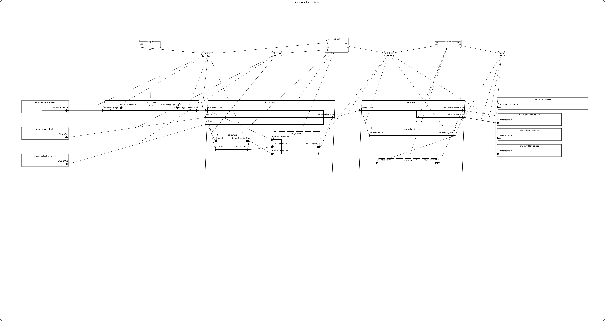

# instalacja_alarmowa_aadl

## Dane Autorów
Radosław Barszczak
 rbarszczak@student.agh.edu.pl

## Opis ogólny
Modelowany system to instalacja alarmowa wykrywania i przeciwdziałania pożarom, zaprojektowana w języku AADL. Celem modelu jest odwzorowanie architektury systemu wczesnego reagowania na potencjalne zagrożenia pożarowe w budynku i ewentualne wezwanie służb ratunkowych.
  System składa się z zestawu czujników i urządzeń wykonawczych, które współpracują w czasie rzeczywistym, aby zapewnić:
- Wczesne wykrycie symptomów pożaru (np. wzrost temperatury, obecność dymu lub czadu),
- Monitoring wizyjny newralgicznych obszarów,
- Automatyczną reakcję w postaci aktywacji zraszaczy przeciwpożarowych,
- Ewentualną sygnalizację alarmową,
- Ewentualne wezwanie służb ratunkowych.

## Spis komponentów AADL

### Urządzenia (Devices)
- Czujniki temperatury (temp_sensor) - służy do pomiaru temperatury w pomieszczeniach 
- Zraszacze przeciwpożarowe (fire_sprinkler) - służą do gaszenia pożarów gdy już takie wystąpią
- Czujniki dymu i czadu (smoke_detector) - sprawdzają ilość trującego gazu (czadu) i dymu w pomieszczeniu
- Kamera monitorująca (video_camera) - monitoruje newralgiczne miejsca w budynku (serwerownie, kuchnie, rozdzielnie elektryczne)
- Głośniki (alarm_speaker) - informują ludzi o pożarze w budynku
- Lampy alarmowe (alarm_lights) - podobnie jak głośniki informują w sposób wizualny o pożarze
- Urządzenia wzywające pomoc (rescue_call_notifier) - w przypadku wystąpienia pożaru straż pożarna jest wzywana na miejsce.

### Wątki (Threads)

- Wątek zbierający dane z czujników dymu i temperatury (smoke_temp_data_processing_thread)
- Wątek zbierający dane z kamey (camera_data_processing_thread)
- Wątek podejmujący decyzję na podstawie danych z czujników (decision_maker_thread)
- Wątek wykonujący akcje przeciwpożarowe (fire_action_controller_thread)
- Wątek sterujący zawiadamianiem służb ratunkowych (emergency_communication_thread)

### Procesy (Processes)

- Proces zbierający dane z czujników dymu i temperatury i podjmujący decyzję z wczystkich czujników i kamer (data_processing_process)
- Proces zbierający dane z kamer i analizujący te dane (camera_image_processing_process)
- Proces wykonujacy wszystkie działania antypożarowe. (fire_action_controller_process)
  
### Procesor (Processor)

- AMD Ryzen 5600h
- Intel Core i3
- Intel Quark X1000

### Magistrala (Bus)

- Ethernet
- WiFi
- I2C
- GPIO

### System

- System lączący wszystkie komponenty

### Diagram modelu

### Proponowane metody analizy systemu

Brak

### Bibliografia
https://www.intel.com/content/www/us/en/products/sku/79084/intel-quark-soc-x1000-16k-cache-400-mhz/specifications.html
https://www.researchgate.net/figure/Fire-detection-system-architecture-in-AADL-describing-data-flow-during-fire-event_fig3_318815437
 W trakcie realizacji projektu korzystano z narzędzia AI ChatGPT (https://chatgpt.com)
